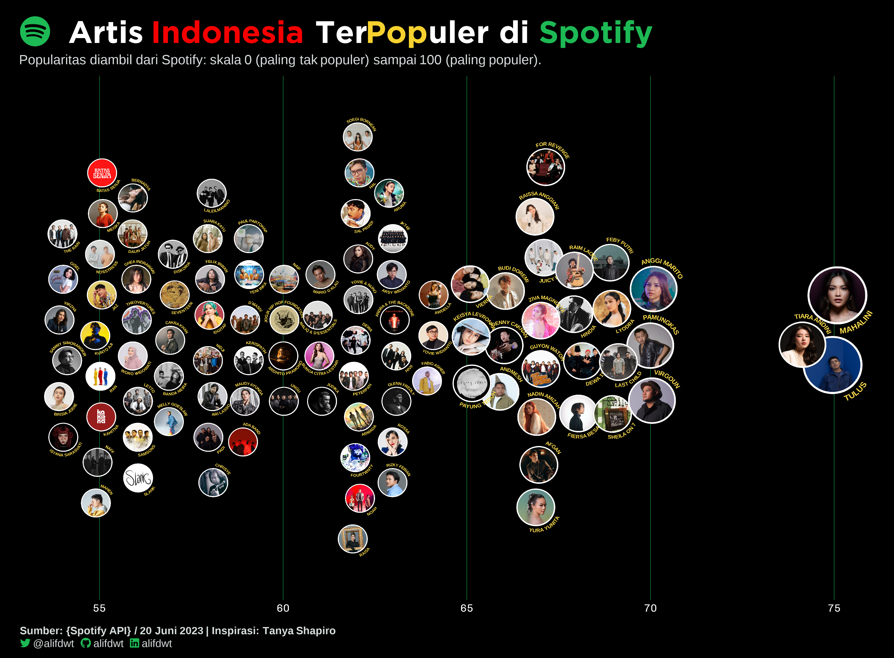
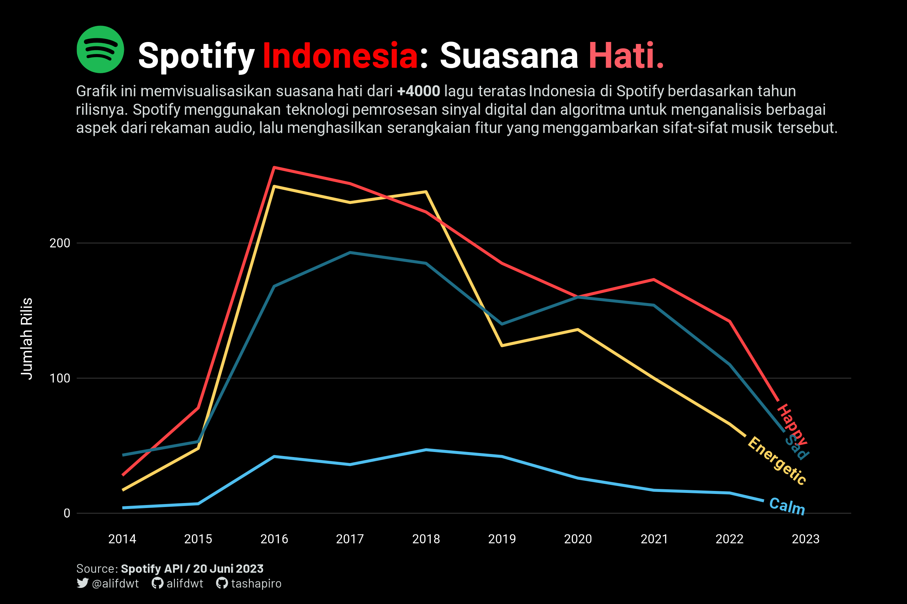
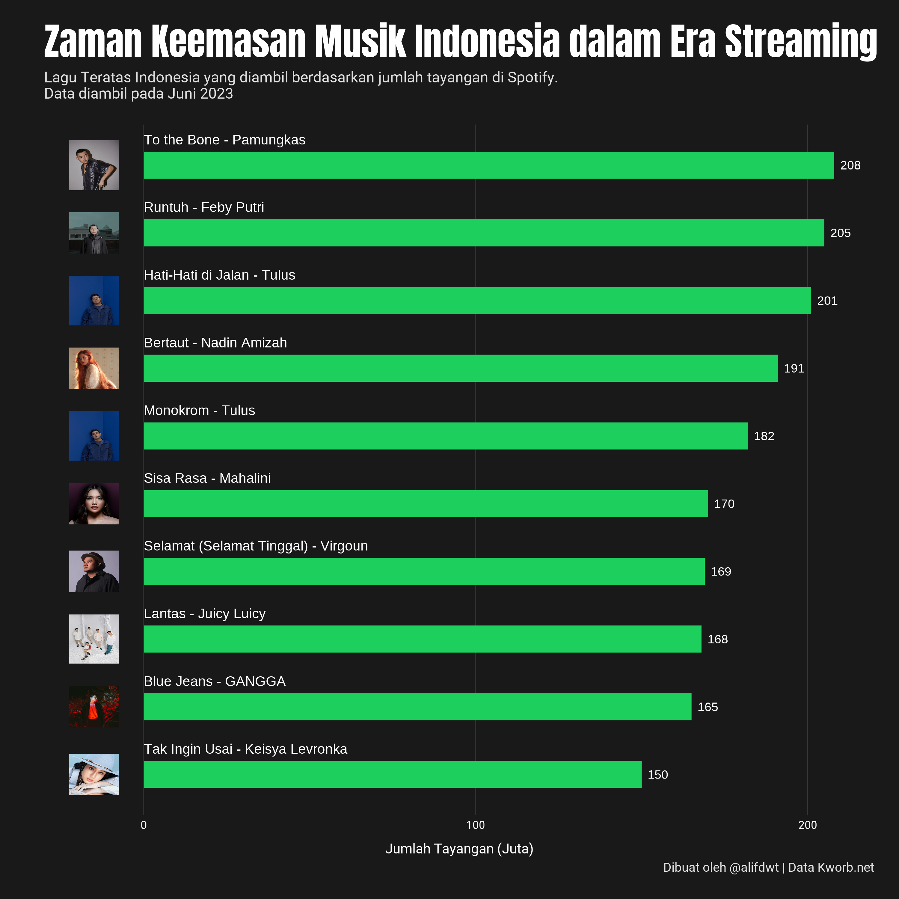

# Visualif

Repositori ini saya buat sebagai wadah kreatifitas saya di bidang visualisasi data.
Sebagian besar proyek visualisasi ini dibuat menggunakan bahasa R, dan di dalam direktorinya akan disertakan juga dataset dan berkas kode.

## Daftar Isi

| **Topic**                                              | **Main Packages**                     | **Source**                |
|:-------------------------------------------------------|:--------------------------------------|:--------------------------|
| [Artis Indonesia di Spotify](./Spotify-Top-Artis-Indo) | ggplot, ggtext, ggimage.              | Spotipy                   |
| [Mood Lagu Teratas Indonesia](./Spotify-Indo-Mood)     | ggplot, ggtext, ggimage.              | Spotipy                   |
| [Lagu Indonesia Teratas](./Spotify-Top-Tracks-Indo)    | ggplot, ggtext, ggimage.              | Kworbs.net                |

## Galeri
## [100 Artis Indonesia Terpopuler di Spotify](./Spotify-Top-Artis-Indo)

## [Mood Lagu Teratas Indonesia](./Spotify-Indo-Mood/spotify-indo-mood.R)

## [Lagu Indonesia Teratas](./Spotify-Top-Tracks-Indo/spotify-top-tracks-indo.R)

