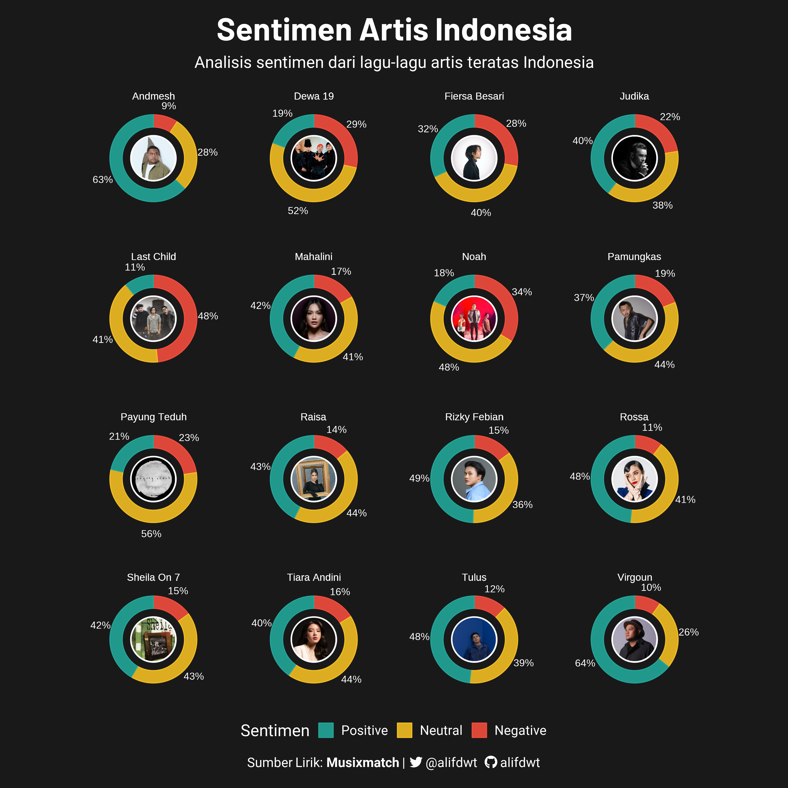
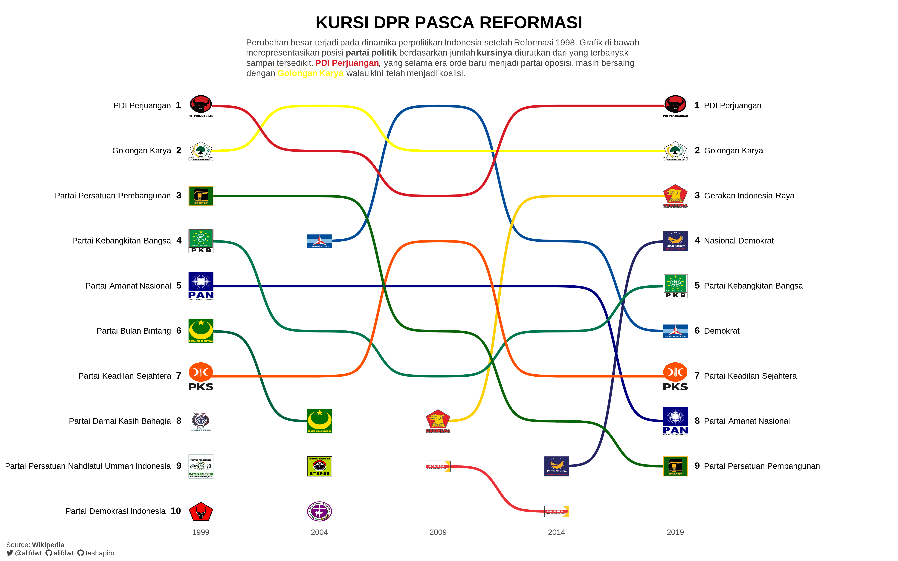

# Visualif

Repositori ini saya buat sebagai wadah kreatifitas saya di bidang visualisasi data, sekaligus catatan perjalanan saya dalam melintasi dunia data. Sebagian besar proyek visualisasi ini dibuat menggunakan bahasa R, dan di dalam direktorinya akan disertakan juga dataset dan berkas kode.

## Daftar Isi

| Judul                                                                    | Paket Utama              | Sumber     | Proses ETL                                                                                                       |
|:------------------------------|:----------------------|:----------|---------|
| [Sentimen Artis Indonesia](./Sentimen-Artis-Indo/sentimen-artis-indo.R)  | ggplot, ggpath, ggtext   | Syrics     | [Lyrics-Sentiment-Analysis](https://github.com/alifdwt/Spotify-Total-Indo/blob/main/03b_Lyrics_Mood_Total.ipynb) |
| [Artis Indonesia di Spotify](./Spotify-Top-Artis-Indo)                   | ggplot, ggtext, ggimage. | Spotipy    | [Spotify-Total-Indo](https://github.com/alifdwt/Spotify-Total-Indo)                                              |
| [Mood Lagu Teratas Indonesia](./Spotify-Indo-Mood)                       | ggplot, ggtext, ggimage. | Spotipy    | [Mood-Predict](https://github.com/alifdwt/Spotify-Total-Indo/blob/main/02_Mood_Predict.ipynb)                    |
| [Lagu Indonesia Teratas](./Spotify-Top-Tracks-Indo)                      | ggplot, ggtext, ggimage. | Kworbs.net | [Scrape-Total-Charts](https://github.com/alifdwt/Spotify-Total-Indo/blob/main/01b_scrape_total_charts.ipynb)     |
| [Kabinet Indo: Kursi DPR Pasca Reformasi](./Kabinet-Indo/Kabinet-Indo.R) | ggplot, ggbump, ggimage  | Wikipedia  | \-                                                                                                               |

## Galeri

## [Sentimen Artis Indonesia](./Sentimen-Artis-Indo/sentimen-artis-indo.R)

## [Spotify: 100 Artis Indonesia Terpopuler](./Spotify-Top-Artis-Indo)

## [Spotify: Mood Lagu Teratas Indonesia](./Spotify-Indo-Mood/spotify-indo-mood.R)

## [Spotify: 10 Lagu Indonesia Teratas](./Spotify-Top-Tracks-Indo/spotify-top-tracks-indo.R)

## [Kabinet Indo: Kursi DPR Pasca Reformasi](./Kabinet-Indo/Kabinet-Indo.R)

